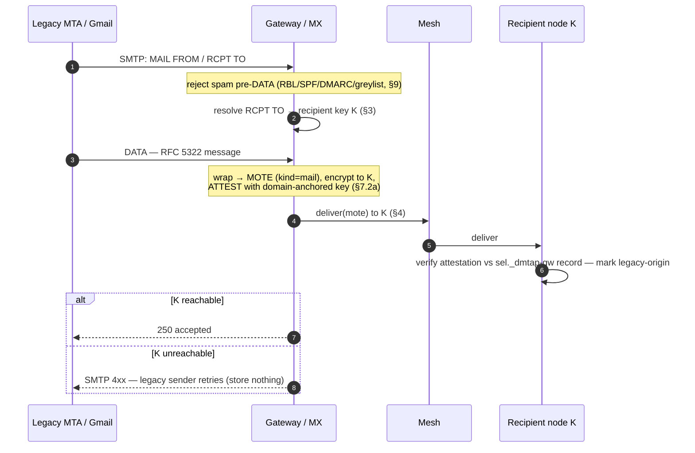
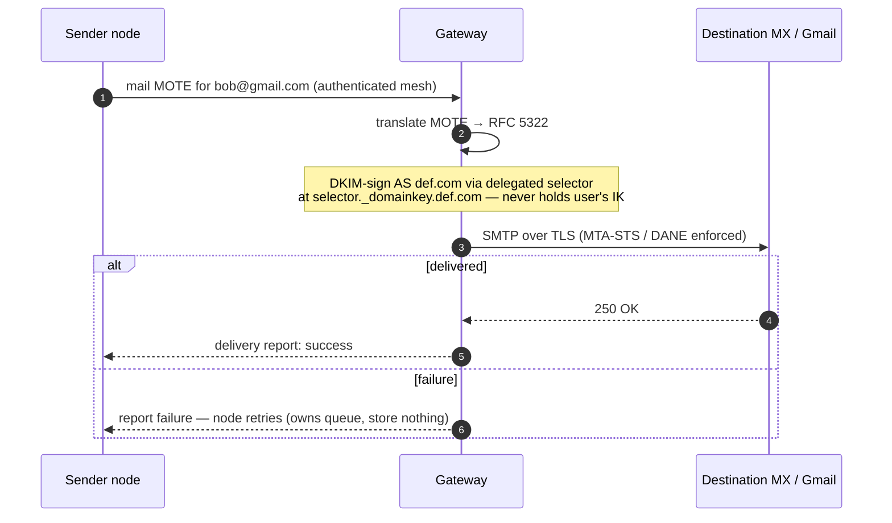

# 7. The Legacy Gateway (optional)

The gateway is the **only** component that speaks SMTP and the **only** one not content-blind
(the legacy leg is unavoidably plaintext). It is **optional** — a node with no legacy
correspondents never uses one, and at full DMTAP adoption it is unnecessary. It MAY be the node
binary run in `--gateway` mode by an operator with a reputable IP and a domain.

## 7.1 Responsibilities

- **Inbound** (legacy → DMTAP): act as MX for a domain, receive SMTP, translate to a MOTE,
  attest it, and deliver into the mesh.
- **Outbound** (DMTAP → legacy): accept a `mail` MOTE marked for a legacy address, translate to
  RFC 5322, DKIM-sign as the sender's domain via **delegated selectors**, and send via SMTP.
- Carry the one irreducible operational cost: **IP reputation** (warmup, feedback loops,
  blocklist remediation, abuse handling).

The gateway is **stateless**: durability is punted to the edges (§7.4).

## 7.2 Inbound

```
1. Gmail connects to  def.com  MX = gateway; SMTP transaction.
2. Reject spam early, before DATA where possible (RBL/DNSBL, SPF/DMARC, greylisting,
   per-IP rate limits) — never accept the bulk of spam (§9).
3. Look up recipient key K for RCPT TO (via DNS/directory §3).
4. Wrap the RFC 5322 message into a MOTE (kind=mail), encrypt to K, and set an
   ATTESTATION: gateway signs "received via gateway G at T from <SMTP envelope>" **with a
   domain-anchored attestation key** (§7.2a), so the recipient can verify it arrived through a
   gateway genuinely authorized for the recipient's domain.
5. Deliver into the mesh to K (§4). If K's node is unreachable, return SMTP 4xx so the
   SENDING server retries (durability punted to the legacy sender). Store nothing.
```



### 7.2a Attestation key binding (normative)

An attestation is worthless unless its signing key is provably bound to a gateway the domain
actually authorized — otherwise any operator could forge "legitimate legacy origin" for a domain
it does not serve. Therefore the domain MUST publish the gateway's **attestation public key**,
analogous to DKIM's selector, in DNS (and MAY anchor it in KT):

```
<sel>._dmtap-gw.def.com.  IN  TXT  "v=dmtapgw1; k=<attestation public key>"
```

Recipient nodes **MUST** verify an inbound MOTE's attestation signature against a key published
under the recipient's own domain (or an explicitly trusted gateway set), **MUST** reject
attestations that do not verify, and **MUST** mark accepted ones as *legacy-origin* (not
end-to-end encrypted before the gateway). This upgrades the former "MAY verify" to a default-on
check with a cryptographic anchor.

## 7.3 Outbound & DKIM delegation

```
1. node → gateway:  a mail MOTE for  bob@gmail.com  (over the mesh, authenticated).
2. gateway translates MOTE → RFC 5322.
3. gateway DKIM-signs as the sender's domain using a DELEGATED selector: the domain owner
   publishes the gateway's DKIM public key at  <selector>._domainkey.def.com  — so the
   gateway signs AS def.com WITHOUT ever holding the user's DMTAP identity key.
4. gateway SMTPs to the destination MX, enforcing TLS via MTA-STS/DANE.
5. On failure, report to the node; the NODE retries (owns the queue). Store nothing.
```



DKIM delegation cleanly separates *deliverability reputation* (the gateway's) from *identity*
(the user's key, never shared).

## 7.4 Statelessness & durability

- Inbound: unreachable recipient → SMTP `4xx` → the **legacy sender** retries.
- Outbound: send failure → the **user's node** retries.
- The gateway holds no queue and no mailbox. Restart it and nodes/senders re-drive; nothing to
  recover or leak.

## 7.5 Decentralization & economics (summary; anti-abuse in §9)

- Many independent gateway operators MAY register in a directory with `{pubkey, reputation,
  region, price, stake}`; nodes select by reputation-to-destination.
- Per-identity accountability + operator stake keep a shared reputation pool safe to
  decentralize (§9). DKIM delegation makes operators swappable (change the delegated selector).
- Postage (§9) MAY fund outbound legacy sending (the stamp the sender attaches is redeemed by
  the delivering gateway), making it revenue-neutral and doubling as spam pricing.

## 7.6 Dual-stack addressing

A single `abc@def.com` is reachable both ways (§3.2): DMTAP senders resolve name→key and go
native (mesh, no gateway); legacy senders use MX→gateway. Capability is discovered per-sender;
no coordination is required, and native traffic grows while gateway traffic fades.

## 7.7 Fairness, self-host backstop & non-lock-in

DMTAP does not — and cannot — mandate that every gateway serve everyone. It instead makes **no
gateway load-bearing**, so fair access is a structural property, not a rule requiring anyone's
compliance.

### You never need a specific gateway

- **DMTAP-native needs no gateway.** DMTAP↔DMTAP delivery is key-based over the mesh (§4); a user
  with only DMTAP correspondents never invokes one.
- **Self-host is always available.** Any user with a reputable IP and a domain MAY run the
  gateway (§7) themselves and depend on no third party. This **self-host backstop** makes
  gateway access a *right* (you can always serve yourself), not a grant.

### Why a universal-service mandate is infeasible

A protocol rule "every gateway MUST accept all traffic" is:

1. **Unenforceable** — no authority can compel a sovereign operator in a decentralized system;
   refusal or silent degradation cannot be prevented.
2. **Economically self-defeating** — a gateway forced to accept all traffic inherits the abuse
   that destroys its IP reputation, degrading the service for everyone. This is precisely why
   open SMTP relays died.

So DMTAP does not attempt it. Fairness is achieved by the four mechanisms below instead.

### How fairness is achieved

1. **The self-host backstop** (above) — the guaranteed right to serve yourself.
2. **A competitive, swappable market.** DKIM delegation (§7.3) + key-identity (§1) mean **zero
   lock-in**: a user switches operators with a DNS/DKIM change and no data migration (the box
   is the authority). If one operator refuses, another serves; switching is free.
3. **The accountability layer makes open service viable.** Open relays failed because abuse was
   unattributable. DMTAP attributes every send to an anonymous-but-accountable ARC token +
   optional postage + operator stake (§9), so a gateway *can afford* to serve strangers openly
   — abuse is priced and per-token-bannable, not a reputation-destroying free-for-all. Openness
   is no longer suicidal.
4. **An optional commons gateway.** A non-profit or protocol-funded operator MAY commit to
   universal, non-discriminatory service (a "public option"), funded by postage/donations, as
   **one operator among many** — not a mandate on all. Reputation ratings (§7.5) reward open
   operators and down-rank discriminatory ones, applying soft, market-driven fairness pressure.

The result is stronger than a mandate could enforce: because you can always route around,
self-serve, or switch — and because accountability makes genuinely-open gateways survivable —
no operator can act as a gatekeeper, without any unenforceable obligation being imposed.

## 7.8 Transport-path provenance (what a recipient can prove about a message's path)

The gateway attestation of §7.2a is not only an anti-spoofing check — it is the **seed of a
verifiable transport-path provenance model**. A recipient (and only the recipient) can learn and
verify **which trust boundaries a message crossed on its way in**, enough for a client to render a
transport-path graph (§8.6), **without** learning anything the mesh is designed to hide. The model
has three parts.

### 7.8.1 What a recipient can learn (and what it deliberately cannot)

**(a) Transport tier.** Whether the message arrived on the **`private`** tier (mixnet + cover,
§4.4) or the **`fast`** tier (direct/low-hop, §4.5). The recipient node knows this from *how it
received the packet* — it is an **observation**, not a sender claim.

**(b) Gateway-touched vs. pure-mesh.** A message that transited a **legacy gateway** carries that
gateway's §7.2a attestation (`GatewayAttestation`, §18.3.11) sealed inside its `Payload`
(§18.3.5 key 9) ⇒ it is **legacy-origin / gateway-touched**: it was plaintext at a gateway before
the mesh. A **native** DMTAP↔DMTAP message carries **no attestation at all** ⇒ it is
**provably pure-mesh — never plaintext at any gateway**, end-to-end encrypted the whole way. This
inference is **sound** precisely because §7.2a makes the attestation **mandatory** for legacy
mail and requires the recipient to **reject** unattested legacy-origin mail (`0x0601`/`0x0602`,
§19.3.1): so every *accepted* message is either validly attested (gateway-touched) or attestation-
free (pure-mesh) — there is no third state in which legacy plaintext slips in unmarked.

**(c) A coarse, privacy-safe hop descriptor.** For the `private` tier the recipient learns only the
**profile floor** the message satisfied — `≥ 3` hops (Standard) or `≥ 5` (High-security), §4.4.10 —
**never** the identities, addresses, count-beyond-the-floor, or per-hop timing of the mixes it
traversed. **This is intentional and is the privacy guarantee, not a gap:** the private tier is
*designed* so no party — including the recipient's own node — can reconstruct the path (§6.2,
§4.4). Provenance therefore answers **"which trust boundaries did this cross?"** (a mixnet? a
gateway? whose?) — **never "which nodes carried it?"**. For the `fast` tier the descriptor MAY note
the directly-observed hop, which exposes nothing beyond what `fast` already reveals (the graph is
observable on `fast`, §4.6, §6.5).

### 7.8.2 The provenance record

The recipient node assembles a **`ProvenanceRecord`** (§18.8.1) at reception, composing the
**observed** transport (tier/profile/coarse-hops, part (a)/(c)) with the **verified** sealed
attestation chain (part (b)). It is **node-local** — served only to the owner's own devices over
the authenticated client surface (§8.1, §19.9), never attached to a MOTE or shown to any third
party — and it carries **no mix-node identity** (§6.8). The gateway attestation it verifies
(`GatewayAttestation`, §18.3.11) travels **sealed inside the encrypted `Payload`**, so the gateway
identity, receipt time, and legacy-sender address it names are visible **only to the recipient** —
they are **never** exposed to a mixnet intermediary, preserving §6 metadata privacy in full.

### 7.8.3 Chaining multiple gateways

If more than one gateway bridges a message (uncommon; the dominant case is a single inbound
gateway), `Payload.provenance` carries an **ordered chain** of `GatewayAttestation`s (`seq`,
§18.3.11). Each entry is verified independently against the `_dmtap-gw` key published under **its
own `domain`**; the entry that bridged mail for the recipient MUST verify under the **recipient's
own domain** (§7.2a), and entries under other domains verify only if that domain is in the
recipient's explicitly-trusted gateway set, else they are surfaced as an *unverified hop*. **One**
valid attestation already establishes *gateway-touched*; the chain merely shows the full legacy
path. A **deniable** message (§5.2.1) never carries a chain — deniable traffic is native P2P and
never transits a gateway.

## 7.9 Self-host `@host.net`, gateways, and billing

DMTAP is explicit about who pays for what, and the provenance model (§7.8) makes it
**auditable**.

- **You may self-host your own domain.** A domain owner MAY run their **own node** for
  `you@host.net` — Tier C (§3.8), self-hosted domain authority (§3.10.1) — and reach every other
  DMTAP user **natively over the mesh with no gateway and no operator at all** (§7.7 self-host
  backstop). Native mesh delivery is **key-based and free**: no gateway is involved, so **nothing
  is billable** for it — this is the §12.3 inviolable rule (the seam meters *operations*, never
  native delivery or any privacy/crypto path).
- **Reaching the legacy world uses a gateway, and *that* is the billable event.** To exchange mail
  with legacy (`@gmail.com` etc.) a self-hoster uses a **gateway** — either **their own**
  (self-hosted `--gateway`, §7; then they bear only the IP-reputation cost, and there is no
  third-party bill) or a **third-party operator's**. Billing attaches to **gateway operations
  only** — metered legacy sends/receives (§12.2 Metering, §12.6) — **never** to native mesh
  delivery. Exactly the messages that carry (outbound) or receive (inbound) a §7.2a attestation are
  the ones a bill can reference; a pure-mesh message (§7.8.1(b)) is by construction **not** a
  gateway operation and **not** billable.
- **How a self-hoster is authorized by a third-party gateway.** Using someone else's gateway is a
  **relationship the gateway operator's policy governs** (`GatewayAuthz`, §12.2), not a protocol
  entitlement: the operator authorizes the self-hoster's identity (per-identity accountable token,
  §9), the self-hoster **delegates a DKIM selector** to that gateway for outbound (§7.3, §3.8) and
  points **inbound MX** at it for legacy receipt (§7.2), and the operator meters and bills the
  resulting legacy egress/ingress. Because DKIM delegation is a DNS change with **zero lock-in**
  (§7.7), a self-hoster can switch or drop the gateway at any time and fall back to native-only or
  to self-hosting the gateway.
- **The bill is auditable to the user.** Because every gateway-touched message carries a verifiable
  §7.2a attestation naming the gateway `domain` and receipt time, a user can **cryptographically
  confirm** that each billed legacy operation corresponds to a real message that actually used the
  gateway — "you were billed because *this* message used the gateway" is checkable against the
  message's own `ProvenanceRecord` (§18.8.1, §7.8), not taken on trust. Conversely, a message the
  client shows as **pure-mesh** MUST NOT appear on a gateway bill. This closes the loop between the
  §12 billing seam and what the user can independently verify (§12.7).

## 7.10 Native ↔ legacy address mapping (a swappable gateway alias, normative)

A native DMTAP domain (`imran@mydomain.com` with a `_dmtap` record but **no legacy MX**) must still
interoperate with legacy email (Gmail) through a gateway. The gateway is a **bridge, not an identity
owner**: the **native address is the anchor**, the **gateway alias is a separate, rotatable pointer**,
and the native mesh never touches a gateway (§7.7). This section specifies the address mapping in both
directions and the two alias encodings.

### 7.10.1 Native → legacy (why a reply-path rewrite is required)

When a native user sends to a legacy recipient, the gateway MUST rewrite the **return / reply path**
to a **legacy-routable gateway alias**, because **legacy email cannot route a reply to a non-MX native
address**: a Gmail user replying to `imran@mydomain.com` would have its MTA look up `mydomain.com`'s
MX, find none (native domains publish no MX), and bounce. So the machine `Reply-To:` / envelope-from
MUST be the **gateway alias** (which *does* have an MX → the gateway); the display MAY still show the
friendly native `imran@mydomain.com` (an RFC 5322 display-name/comment) for the human. A legacy reply
then routes to the gateway, is mapped back to the native address (§7.10.3), converted to a MOTE, and
delivered over the mesh.

### 7.10.2 Two alias encodings (offer both — normative tradeoff)

A gateway MUST support at least one and SHOULD offer both; the choice is disclosed to the user:

| Encoding | Form | Gateway state | Privacy tradeoff |
|----------|------|---------------|------------------|
| **Encoded** | `localpart.nativedomain@gateway.domain` | **near-stateless** (self-describing; the alias *is* the mapping) | **reveals the native domain** to the legacy recipient |
| **Random** | `<rand>@gateway.domain` + a gateway `GatewayAliasMap` (§18.3.12) | **stateful** (a per-alias table row) | **hides** the native address (Hide-My-Email-style); supports **per-correspondent, burnable** aliases |

**Encoded local-part format (unambiguous, reversible, RFC 5321-valid).** Pack a native
`localpart@nativedomain` into a **single** SMTP local-part by joining the two with a reserved
separator and **escaping** any separator that occurs inside the parts:

```
encode(localpart, nativedomain):
  esc(s) = replace every "-" with "--", then every "." with "-."   ; reversible escaping
  local  = esc(localpart) ‖ "." ‖ esc(nativedomain)                ; "." at the TOP level is the sole join
  alias  = local ‖ "@" ‖ gateway.domain
decode(local):
  split `local` at the single UNescaped top-level ".", un-escape each half → (localpart, nativedomain)
```

The escaping makes the top-level join `.` **the only unescaped `.`**, so decode is unambiguous and
the round-trip is exact (`imran` + `mydomain.com` → `imran.mydomain-.com@gateway.domain` →
`imran` + `mydomain.com`). The result MUST be RFC 5321-valid: the local-part MUST be ≤ 64 octets and
the whole path ≤ 254 octets (§16.11); an over-length or non-decodable encoding MUST be rejected
(`ERR_GATEWAY_ALIAS_ENCODING_INVALID`, `0x0606`, FAIL_CLOSED_BLOCK — the gateway MUST NOT **guess** a
native address from an ambiguous local-part). A gateway MAY instead use a strict `base32`/`base64url`
packing of `det_cbor([localpart, nativedomain])`; the escaping form above is the normative default so
two gateways interoperate on encoded aliases.

**Random form.** A `<rand>@gateway.domain` (a high-entropy localpart) is stored in a
`GatewayAliasMap` row (§18.3.12) binding `alias → native`, OPTIONALLY scoped to one `correspondent`
and **burnable** (a per-sender throwaway). It reveals nothing about the native domain, at the cost of
gateway-held state and the availability of that mapping.

### 7.10.3 Legacy → native

The gateway MX receives at the alias, runs the **existing DKIM/SPF/DMARC** anti-spoof checks (§7.2),
maps **alias → native** (decode the encoded form, or look up the `GatewayAliasMap` row; an
unmapped/expired/burned random alias, or a non-decodable encoded one, fails
`ERR_GATEWAY_ALIAS_UNMAPPED`, `0x0605`, RETURN_SENDER_SMTP `550 5.1.1` — "no such user," identical to
the §21.9 non-existent-recipient reply, since the bridge owns no identity to defer to), converts the
RFC 5322 message to a **signed MOTE**, stamps a gateway-touched `GatewayAttestation` /
`ProvenanceRecord` (§7.2a, §7.8), and delivers to the mesh (§4) at the native key.

### 7.10.4 Swappable / ephemeral, and the honest residual

The gateway alias is **separate from identity**: it is **rotatable** (change or burn it with no effect
on the native address or key), **non-permanent**, and **multi-gateway** (the native user MAY bridge
through several gateways at once, each with its own aliases). The **native address is the anchor** —
the thing that survives — exactly as the key is the anchor under the native address (§7.7 non-lock-in,
zero-migration DKIM-delegation switch).

**Residual (disclosed, §6.6).** The legacy leg is **plaintext at the legacy recipient and
gateway-visible** — bridging to old email is **inherently non-private**: the gateway is the one
component that is not content-blind (§7 preamble), the encoded form additionally discloses the native
domain to the recipient, and a legacy MTA sees the mail in the clear. The **native mesh never touches a
gateway** (a pure-mesh message is provably end-to-end, §7.8.1(b)), and every gateway-touched message is
**marked** so the user sees which mail crossed the bridge (`ProvenanceRecord`, §8.6). DMTAP states this
honestly rather than implying the bridge inherits mesh privacy.
